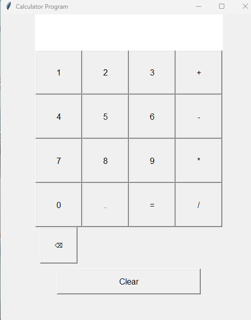

# calculator-website

# 🧮 Tkinter Calculator

A simple calculator built using Python's Tkinter library. This GUI-based calculator supports basic arithmetic operations including addition, subtraction, multiplication, and division. It also includes features like backspace and clear functionality.

---

## 📸 Preview

 <!-- Replace with your actual image or remove this line if not applicable -->

---

## 🛠 Features
- 🧠 Basic arithmetic operations: `+`, `-`, `*`, `/`
- 🔢 Numeric buttons (0-9)
- 🧮 Decimal support with `.`
- ↩️ Backspace functionality (`⌫`)
- ♻️ Clear all inputs (`Clear`)
- 📟 Dynamic result display
- 🖥️ Responsive and clean GUI with `Tkinter`

---

## 🚀 Getting Started

### 📦 Requirements

- Python 3.x

### 🧑‍💻 How to Run

1. Clone the repository:
   ```bash
   git clone https://github.com/dsaimani/calculator-__website.git
   cd calculator-__website

